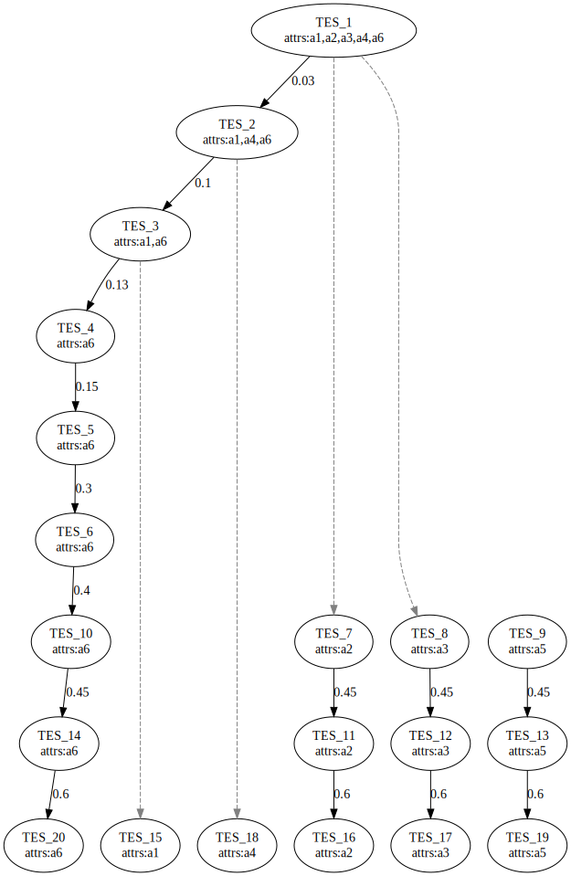

```{r, include = FALSE}
knitr::opts_chunk$set(
  collapse = TRUE,
  comment = "#>"
)
```

## What is `diffeRenTES`?

*diffeRenTES* is a small package written in R that focuses primarily on the computation of the tree-like structure describing the cell differentiation process following the mathematical model firstly described in the work [@serra].


## How can you install it?

To install the latest development version of `diffeRenTES` directly from [GitHub](https://github.com/mbraccini/diffeRenTES) use: 

```{r, message=FALSE, warning=FALSE, results = "hide", eval=FALSE}
library(devtools)
devtools::install_github("mbraccini/diffeRenTES")
```

## How can it be used?

```{r setup}
library(diffeRenTES)
library(BoolNet)
```

```{r, message=FALSE, warning=FALSE, results = "hide",echo=FALSE}
set.seed(333)
```

For example purposes a random Boolean network using the *BoolNet* R package is generated.
In real world application any Boolean network can be generated or loaded (e.g., by using the *loadNetwork* method of the BoolNet package), as long as it is stored in an object of class *BooleanNetwork*.

```{r, warning=FALSE}
net <- BoolNet::generateRandomNKNetwork(10, 2)
attractors <- BoolNet::getAttractors(net) 

# Attractors Transition Matrix computation
ATM <- getATM(net, attractors, MAX_STEPS_TO_FIND_ATTRACTORS = 100) 

# ATM structure in matrix format.
# a1, a2, etc. refer to the attractors found.
print(ATM$ATM)

# No. perturbations that have not reach another attractor within the provided MAX_STEPS_TO_FIND_ATTRACTORS
print(ATM$lostFLips)
```

Then, the Threshold Ergodic Sets (TESs) are computed, which, remember, represent the different cell types in this model.

```{r, warning=FALSE}
#TESs computation
TESs <- getTESs(ATM) 

#Retrieve the computed TESs
print(TESs$TES)

#And the noise thresholds at which they emerge.
print(TESs$thresholds)
```

Lastly, the following code saves the image of the computed differentiation tree to the file system.

```{r,message=FALSE, warning=FALSE,results = "hide"}
# Saving the TES-based differentiation tree into a file
saveDifferentiationTreeToFile(TESs, file.path(tempdir(), "example.svg")) 
```

The resulting differentiation tree is presented. It reports the various TESs with the attractors of which they are composed and the differentiation process emerging from the reduction of intra-cellular noise, synthesized by the thresholds present in the direct arcs.


## References


